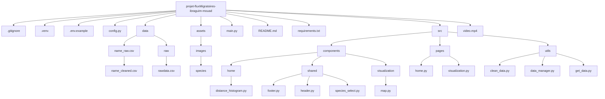

# Flux Migration Dashboard

## **User Guide**

### **Overview**
The Flux Migration Dashboard provides an interactive visualization of global migration patterns. Using publicly available Open Data, it highlights trends, geographical distributions, and key metrics related to migration flows. This tool is designed to foster a better understanding of migration's impact and dynamics worldwide.

### **Getting Started**
1. **Clone the repository**:
   ```bash
   git clone https://github.com/Swaroskiks/projet-fluxMigratoires-ibraguim-mouad.git
   cd projet-fluxMigratoires-ibraguim-mouad
   ```

2. **Set up the environment**:
   ```bash
   python -m venv .venv
   source .venv\Scripts\activate  # On MacOS/Linux: .venv/bin/activate
   pip install -r requirements.txt
   ```

3. **Run the dashboard**:
   ```bash
   python main.py
   ```

4. **Access the dashboard**:
   Open your browser and navigate to `http://127.0.0.1:8050/`.

---

## **Data**

### **Source**
The dataset used in this project is sourced from [MoveBank](https://www.movebank.org/cms/webapp?gwt_fragment=page=search_map) API, providing detailed information about migration flows, including:
- Population size
- GPS data
- Time periods (daily/weekly)


### **Structure**
- **Raw Data**: Stored in `data/raw/name_of_specie_raw.csv`. Contains unprocessed migration statistics.
- **Cleaned Data**: Stored in `data/cleaned/name_of_specie_clean.csv`. Pre-processed and ready for visualization.

---

## **Developer Guide**

### **Project Structure**



### **Key Functions**
- **`clean_data.py`**: Prepares raw data for analysis by applying transformations and ensuring data integrity.
- **`get_data.py`**: Retrieves datasets from APIs or static files.

---

## **Analysis Report**


### **Key Findings**
1. **Global Migration Trends**:
   - Individual-level movement data allows tracking of migration pathways.
   - Temporal data highlights periods of increased activity.
2. **Geographical Distribution**:
   - Interactive mapping shows migration routes using precise geolocation data.
   - Significant patterns emerge based on clustering of longitudes and latitudes.
3. **Dynamic Insights**:
   - Speeds and distances are computed using Haversine distance.
   - Seasonal and event-based migration trends are revealed through timestamp analysis.


### **Visualization Highlights**
- **Histogram**: Shows distribution of movement events over time (e.g., days, weeks).
- **Interactive Map**: Visualizes migration patterns with detailed species-specific data.
- **Statistical Cards**:
  - **Total Distance**: Aggregated distance traveled by individuals.
  - **Average Speed**: Computed speed of movement across events.
  - **Maximum Distance**: Farthest distance between two recorded points.
  - **Duration**: Total tracking duration in days.


---

## **Copyright**
   We hereby declare that the code provided in this project was created solely by Mouad MOUSTARZAK and Ibraguim TEMIRKHAEV.
All other code is original, and failure to attribute any external source will be considered plagiarism.

---

## **Video Demonstration**
[lien vers la video sur git]

---
